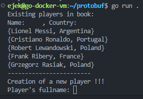

# Refs

https://protobuf.dev/overview/

https://protobuf.dev/getting-started/gotutorial/

# Lab

## Env setup

```sh
# installation of protobuf complier (protoc) 
# complier creates .go files from .proto files
# provides programming interface in go for .proto defined data structs
sudo apt install protobuf-complier
# interface between protoc a golang
go install google.golang.org/protobuf/cmd/protoc-gen-go@latest
# to create go code in current dir
protoc greet.proto --go_out=$(pwd)
```

## Example message

As you remember Protocol Buffer is an Interface Description Language, used in Remote Procedure Calls. The Protocol it builts consists of messages. Protocol Buffer is a really good tool to define structure of protocol messages (telco world will understand). Thats why the main body of data struct in Protobuf is called *Message*

```protobuf
syntax = "proto3";
package tutorial;

option go_package = "com.tutorialspoint.greeting";  

message Greet {
   string greeting = 1;
   string username = 2;
}
```

`package` - it is the package internally in the protobuf (not any programming language)

`option go_package` = # This tells the compiler to which golang package the generated go file has to belong to

# My case

I will not provide link for git repository. The lab was just two files of which content I will paste below. Reader can easily reconstruct the project.

I did some simple recordbook aka database of Football Players.

My .proto file

```protobuf
syntax = "proto3";
package players;
option go_package = "protos/";

message FootballPlayer {
   string name = 1;
   string country = 2;
}

message Players {
   repeated FootballPlayer list = 1;
}
```

Then remember to generate needed golang classes:

```sh
go install google.golang.org/protobuf/cmd/protoc-gen-go@latest
export PATH=$PATH:$(go env GOPATH)/bin
protoc players.proto --go_out=$(pwd)
```

Then main func looks like this.

```golang
func main() {
	fname := "players.bin"

	book := &protos.Players{}

	// Read the existing book.
	in, err := os.ReadFile(fname)
	if err != nil {
		log.Fatalln("Error reading file:", err)
	}
	if err := proto.Unmarshal(in, book); err != nil {
		log.Fatalln("Failed to parse address book:", err)
	}
	print("Existing players in book:\n")
	print("Name:     , Country:     \n")
	for _, x := range book.List {
		out := fmt.Sprintf("{%s, %s}", x.Name, x.Country)
		println(out)
	}

	print("------------------------\nCreation of a new player !!!\n")
	reader := bufio.NewReader(os.Stdin)
	print("Player's fullname: ")
	name, _ := reader.ReadString('\n')
	name = strings.TrimSpace(name)
	print("Player's country: ")
	country, _ := reader.ReadString('\n')
	country = strings.TrimSpace(country)

	// create new player
	a := protos.FootballPlayer{
		Name:    name,
		Country: country,
	}

	book.List = append(book.List, &a)

	out, err := proto.Marshal(book)
	if err != nil {
		log.Fatalln("Failed to encode address book:", err)
	}
	if err := os.WriteFile(fname, out, 0644); err != nil {
		log.Fatalln("Failed to write address book:", err)
	}
}
```

This program reads the players from binary file (ofc. first you need to create such file - it can be empty `players.bin` file). Then it displays its content and you can add new player.

