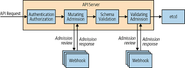

### What is a Webhook?
A **webhook** in the Kubernetes context is a mechanism to intercept and modify or validate the operations requested against Kubernetes resources. Webhooks are often used in the following contexts:

1. **Admission Webhooks**: These are HTTP callbacks that Kubernetes triggers during the API request handling process. They help validate or mutate resources before they are committed to etcd (Kubernetes' key-value store). There are two main types:
   - **Mutating Admission Webhooks**: These modify the resource before it is stored, such as adding default values to fields that the user did not set.
   - **Validating Admission Webhooks**: These check if the resource configuration complies with certain rules or constraints, and can deny a request if it does not.

Webhooks are commonly used to:
- Enforce security policies (e.g., only allowing certain container images).
- Inject sidecar containers (e.g., for observability tools).
- Set defaults or validate configurations in custom resources.

Every API request goes through such path:

