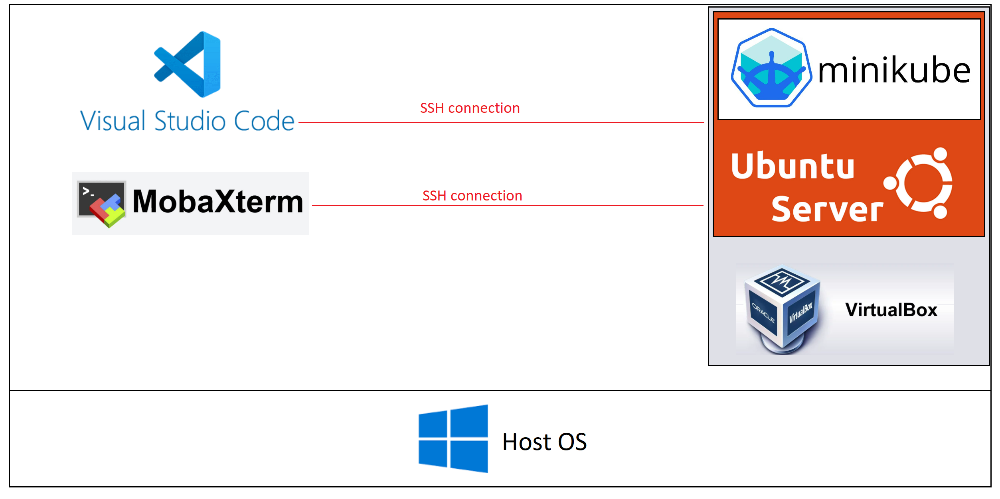
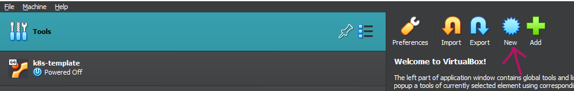
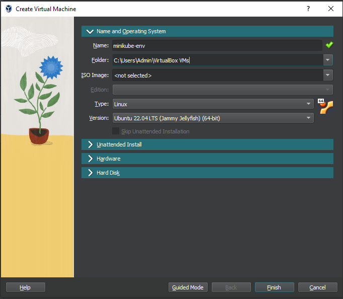
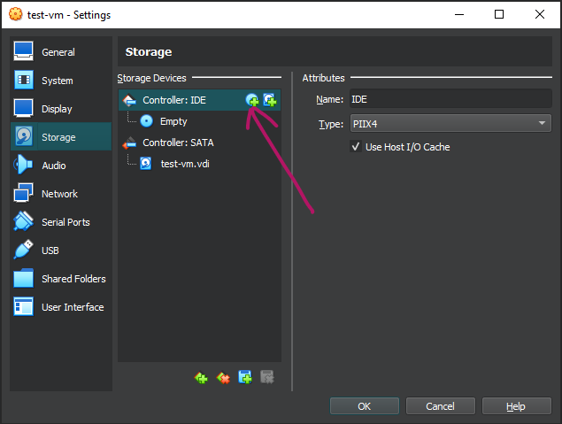
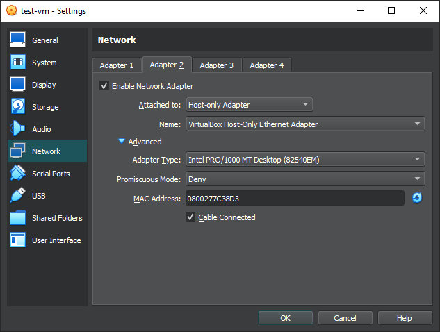

# Minikube Development Environment

This document outlines a straightforward method for setting up an environment for Kubernetes (k8s) operators development.

To develop k8s operators, the primary requirement is a Kubernetes cluster. (While not necessary for the development phase itself, a cluster is essential for testing the operators against Custom Resources within the cluster). Fortunately, a real k8s cluster is not required. Your operator will interact with cluster objects via a kube-api-server. Minikube effectively simulates an entire cluster within a single Docker container and exposes the kube-api-server port for communication. From the perspective of the operator, this solution is entirely transparent and adequate.

Kubernetes operators can be developed using Ansible, Helm, or Go. However, Go offers the most comprehensive functionality, making it the preferred choice for this solution.

## Architecture

The architecture choices reflect my personal preference for certain tools. For hosting Minikube, I have selected Ubuntu Server as the Host OS. In turn, the Ubuntu Server is hosted on a VirtualBox machine. To connect to the Ubuntu Server Virtual Machine, I use Visual Studio Code and MobaXterm as SSH clients.



The Host OS in my case is Windows 10, but it is agnostic as long as you can run VirtualBox on it. 

I am using two SSH clients (Visual Studio Code and MobaXterm), because VSC is more convenient for coding and MobaXterm for other types of activities. 

# Setup steps

## Intro

The setup steps are outlined below:

1. Install Oracle VM VirtualBox.

2. Create Ubuntu Server VM.

3. Configure Ubuntu-Server VM.

4. Install Minikube dependencies.

5. Install Minikube itself.

6. Install Go.

Brief descriptions of each step with important stuff to note can be found below. Do not execute any actions at this point. This will only scaffold our way of doing. Step by step guide will be provide in next sections. 

**1. Install VirtualBox machine**

Intentionally left blank.

**2. Create Ubuntu Server VM**

Create a Virtual Machine and select Linux as the type. Do not attach an ISO image during creation. Instead, we will boot it for the first time with an ISO image inserted as a storage device. Also, remember to enable a second network adapter (set as Host Only) before the first boot, as this is crucial and can prevent potential issues.

**3. Configure Ubuntu Server VM**

It is a good practice to setup a hostname of a machine and to set a static IP address within our host-only network. This simplifies the SSH connection process.

**4. Install Minikube dependecies**

As previously mentioned, Minikube requires Docker to host it as a container. While there are other options like Podman and Hyperkit, Docker is our choice.

We will also install Kubectl as a separate program from Minikube. Although Minikube includes a built-in Kubectl, its use is less convenient.

Additionally, we will employ a helpful trick that will make our solution even more amicable by applying alias of `k` to `kubectl`. 

**5. Install Minikube itself**

No magic here. Installation of Minikube is very easy.

**6. Install Go**

We will use Go and Kubebuilder for developing k8s operators. Nonetheless, this tutorial does not cover the installation of Kubebuilder, as it is advisable to install it just before starting the development process.

**Small remark**

Before proceeding, it's important to note that this document aims to be as simple and concise as possible. Therefore, most of the setup steps refer to and direct readers to external pages. This serves a dual purpose: firstly, to avoid redundancy, and secondly, to acknowledge that the specifics of some instructions may change over time. It's preferable to guide the reader to official pages, with this document serving as a roadmap for tool selection and configuration.

## 1 Install Oracle VM VirtualBox

Follow this page: https://www.virtualbox.org/wiki/Downloads

The version I am using is 7.0.8

## 2 Create Ubuntu Server VM

### 2.1 Download Ubuntu Server ISO image.

https://ubuntu.com/download/server 

Select Option 1 - Manual Server Installation.

### 2.2 Create new "empty" VM in VirtualBox





Adjust Hardware and Hard Disk to you preferences. 

The settings I used was:

- 4 CPU
- 8192 MB of RAM
- 50 GB of hard disk 

But I believe it is way more than needed. I was just biased by the fact that my previous installation with the choice of 10GB of hard disk failed due to the insufficient memory for Docker. 

Do not boot up the machine yet!

### 2.3 Insert iso image

Go to the created VM settings and select the storage section.



Select the option to Add optical Driver and choose the previously downloaded `.iso` file from your host OS filesystem. 

Do not boot up the machine yet!

### 2.4 Add second network adapter

The first network adapter is NAT (used for connecting the VM to the internet).

We need to make the machine visible by our Host OS. The easiest way to do this is to plug the machine into our Host-Only network. 

To do so, apply the settings presented below to your VM:



Do not boot up the machine yet!

### 2.5  Boot up the machine and perform installation

First boot of the machine will emulate the installation of Linux system from Compact Disc (CD). 

Remember, when given the opportunity, to:

- Install OpenSSH server
- Uncheck the LVM group

## 3 Configure Ubuntu Server VM

### 3.1 Setup the hostname

```sh
sudo vi /etc/hostname
```

Change the contents of the file to your preferred name. 

> My personal convention involves appending `-vm` to the names of virtual machines. I typically name them after the most recently installed software or a combination of software names that are significant for the intended use of the machine.
>
> In this case I would name the VM "minukube-go-vm".

>  If you don't like `vi` you can use `nano` instead.

```sh
sudo vi /etc/hosts
```

Also change the name in the first line.

### 3.2 Setup the static IP address

```sh
cd /etc/netplan
sudo vi 00-installer-config.yaml
```

> The name of the file can vary, but it should be only one file present under this directory anyway.

Switch off the dns under interface belonging to the host network and assign it some IP address. Exemplary file below:

```sh
# This is the network config written by 'subiquity'
network:
  ethernets:
    enp0s3:
      dhcp4: true
    enp0s8:
      dhcp4: no
      addresses: [192.168.56.109/24]
  version: 2
```

In this example, the VM will get IP address of `192.168.56.109/24`

After saving the file, perform:

```sh
sudo netplan try
sudo netplan apply
# to check if netplan applied
ifconfig # or `ip a` if you don't want to install net-tools
```

After these changes reboot the system 

```sh
sudo shutdown -r now
```

## 4 Install Minikube dependencies

### 4.1 Docker

Follow: https://docs.docker.com/engine/install/ubuntu/#install-using-the-repository

Then (to avoid using `sudo` for every Docker command) execute this command:

```sh
sudo usermod -aG docker $USER
```

These changes will be in force once you log back in.

### 4.2 kubectl

Follow: https://kubernetes.io/docs/tasks/tools/install-kubectl-linux/#install-using-native-package-management

To create the alias:

```sh
echo 'alias k="kubectl"' >> ~/.bashrc
source ~/.bashrc
```

## 5 Install Minikube itself

https://minikube.sigs.k8s.io/docs/start/

## 6 Install GO

Follow: https://go.dev/doc/install

But to preserve between reboots the PATH variable set in the tutorial above add it to `~/,bashrc` so it can be loaded each time a system starts.

```sh
echo 'export PATH=$PATH:/usr/local/go/bin' >> ~/.bashrc
source ~/.bashrc
```

# The end

Now you are ready to go!

Have fun :happy:


