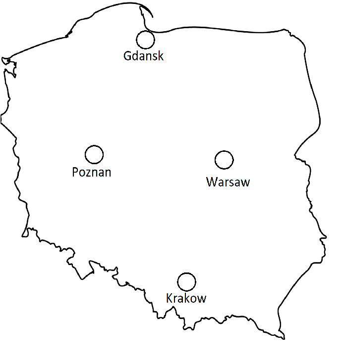

# MME Network
This document presents the business case for the closed control loop application.
## Real world 

Let's image we are the operator of some PLMN (Public Landline Mobile Network) in Poland. We we have 4G technology only. Our customers are served by MME nodes. We have 4 **nodes** in 4 locations as shown below: 



Each user generates a **bearer session** (simple - session). We have extremely high speed transport network, so it is transparent by which node user will be served. We say that at a time (a specific moment) MME servers a number of sessions. Our users generate these sessions in a nearly random manner. We have no control over which geographical area will be loaded the most. When user request for a session, he gets served by the closest MME. But sometimes one MME can be significantly more loaded than others. In such scenario (taking into account our fast transport network) we can move some chunk of sessions to other MME/MMEs. 

Ok, so if we can move session then how do we split the ratio? Each MME has the same percentage part in the whole network? We can do it this way, but it can occur that some MMEs are more efficient than the others. E.g. one model is simply worse (anti vendor lock-in), one model has less resources, we have some temporary failure/breakdown etc... For such cause, we can define that the ratio is not always 25%-25%-25%-25%, but it can be e.g. 20%-20%-30%-30%. 

Overall number of session throughout the day can vary. It is common network some times of the day is more utilized. Also people are moving all the time, so the number of sessions fluctuates between the nodes.

## Mathematically

Bodies:
- **node** - single MME node that can serve a session
- **session** - single unit of demand created by user, need to be served by node

At the start each node has assigned some number of sessions. E.g. 
```
10-12-18-6
```
> It can represents `k` of sessions

At each **round**/**interval** some random small number of session is added/extracted to/from each node. The current session count on a node can be higher/lower/equal to one in previous round.

Here, some exemplary trait over time(rounds) of session counts for each node is presented:
```sh
# roundNumber. Gdansk-Poznan-Warsaw-Cracow
1. 10-12-18-6
2. 11-12-16-8
3. 10-10-17-9
4. 8-8-20-6
5. 6-7-18-8
```

### The need for our closed control loop

You can see that overall number of session on the exemplary trait changes over time and that without any control loop no percentage ratio between locations is established. Traffic between nodes and its capacity moves randomly, and what if at some point in time one of the MME will be overloaded and crashes? Or in a long run perspective what if  one MME will be constantly under-used?

For such cause, our closed control loop finds its application. We need to remember that we have the ability to move sessions over nodes to preserve the requested ratio.

This is use case for reactive closed control loop, it can guarantee that the ratio of sessions between nodes will be enforced.

### The need for deliberative closed control loop

Ok, now we understand how our reactive loop will work. It will guarantee that the requested traffic distribution is applied. But what if operator changes its mind and would like to have some other distribution? Or maybe operator will implement some AI algorithms that will analyze and adjust distribution?

This is the field for application of deliberative loop. This loop will "watch" the reactive one and ensure that it enforces the distribution that is compatible with our vision.

For example some node loses half of its resources --> we need to rearrange. And the distribution can go from `25-25-25-25` to `10-30-30-30`.

> Here, one can remark that for this, only the manual change in configuration file of reactive loop would sufficient. Yes, but:
> - 1st, remember it is only example, a showcase what platform can do
> - 2nd, this is simple scenario of more complex abstraction, you don't have to always utilize 100% features of your tool

Or the change in distribution can be result of AI long term analysis.

#### Summarizing

We have two loops:
- reactive one enforces the proper distribution on the network
- deliberative comes up with the distribution 