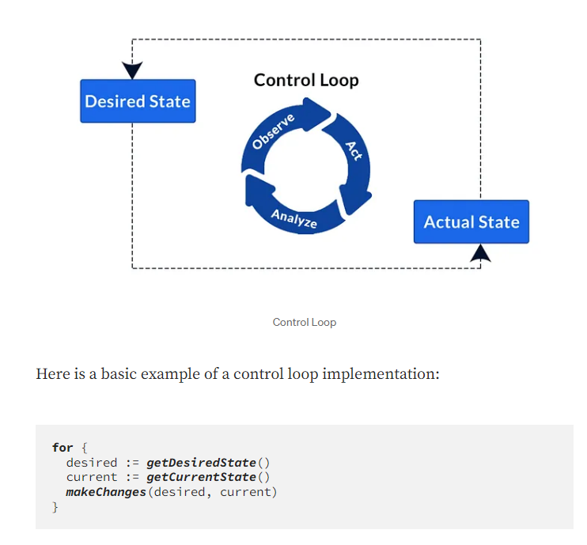

## Custom Resource 

https://thenewstack.io/kubernetes-crds-what-they-are-and-why-they-are-useful/

A *resource* is an endpoint in the [Kubernetes API](https://kubernetes.io/docs/concepts/overview/kubernetes-api/) that stores a collection of [API objects](https://kubernetes.io/docs/concepts/overview/working-with-objects/#kubernetes-objects) of a certain kind; for example, the built-in *pods* resource contains a collection of Pod objects.

The aggregation layer is different from [Custom Resources](https://kubernetes.io/docs/concepts/extend-kubernetes/api-extension/custom-resources/), which are a way to make the [kube-apiserver](https://kubernetes.io/docs/concepts/overview/components/#kube-apiserver) recognise new kinds of object.

> *as for now it is not import what is *aggregation layer*

To add a custom resource you need to define it in a Custom Resource Definition.

https://github.com/kubernetes/sample-controller

Usage of Custom Resource frees you from writing your own API server to handle the custom resource, but the generic nature of the implementation means you have less flexibility than with [API server aggregation](https://kubernetes.io/docs/concepts/extend-kubernetes/api-extension/custom-resources/#api-server-aggregation).

## Operators overview

Operators use the basic capabilities of Kubernetes controllers and resources, but add application-specific or domain knowledge to automate the entire lifecycle of the application it manages.

Operators track cluster events related to specific types of custom resources. These custom resources can track three types of events—add, update, and delete.

When the operator receives the information, it takes action to bring the Kubernetes cluster or external system to the desired state as part of the custom controller scaling cycle.

**To summarize a Kubernetes operator’s workflow:**

1. User makes changes to a CRD
2. The operator tracks the CRD and identifies change events
3. The operator reconciles the CRD state with the desired state
4. The operator adjusts cluster state to the desired state

## Controller Pattern

https://kubernetes.io/docs/concepts/architecture/controller/

A controller tracks at least one Kubernetes resource type. These [objects](https://kubernetes.io/docs/concepts/overview/working-with-objects/#kubernetes-objects) have a spec field that represents the desired state. The controller(s) for that resource are responsible for making the current state come closer to that desired state.

The controller might carry the action out itself; more commonly, in Kubernetes, a controller will send messages to the [API server](https://kubernetes.io/docs/concepts/overview/components/#kube-apiserver) that have useful side effects. You'll see examples of this below.

https://kubernetes.io/docs/concepts/architecture/controller/#design

Important!

As a tenet of its design, Kubernetes uses lots of controllers that each manage a particular aspect of cluster state. Most commonly, a particular control loop (controller) uses one kind of resource as its desired state, and has a different kind of resource that it manages to make that desired state happen. For example, a controller for Jobs tracks Job objects (to discover new work) and Pod objects (to run the Jobs, and then to see when the work is finished). **In this case something else creates the Jobs, whereas the Job controller creates Pods.**

It's useful to have simple controllers rather than one, monolithic set of control loops that are interlinked. Controllers can fail, so Kubernetes is designed to allow for that.

https://able8.medium.com/kubernetes-controllers-overview-b6ec086c1fb

Each resource in k8s has its own dedicated controller. The controller for build-in resources are compiled into single binary and run as a single process in as a `kube-controller-manager`. 

Some types of these controllers are:

- **Node controller**: Responsible for noticing and responding when nodes go down.
- **Job controller:** Watches for Job objects that represent one-off tasks, then creates Pods to run those tasks to completion.
- **Endpoints controller**: Populates the Endpoints object (that is, joins Services & Pods).
- **Service Account & Token controllers**: Create default accounts and API access tokens for new namespaces.

https://docs.bitnami.com/tutorials/a-deep-dive-into-kubernetes-controllers/

## Operator Pattern

The *operator pattern* aims to capture the key aim of a human operator who is managing a service or set of services. Human operators who look after specific applications and services have deep knowledge of how the system ought to behave, how to deploy it, and how to react if there are problems.

People who run workloads on Kubernetes often like to use automation to take care of repeatable tasks. The operator pattern captures how you can write code to automate a task beyond what Kubernetes itself provides.

Operators are clients of the Kubernetes API that act as controllers for a [Custom Resource](https://kubernetes.io/docs/concepts/extend-kubernetes/api-extension/custom-resources/)

https://kubernetes.io/docs/concepts/extend-kubernetes/operator/

OPERATOR WHITEPAPER ----> https://github.com/cncf/tag-app-delivery/blob/163962c4b1cd70d085107fc579e3e04c2e14d59c/operator-wg/whitepaper/Operator-WhitePaper_v1-0.md

Technically, there is no difference between a typical controller and an operator. Often the difference referred to is the operational knowledge that is included in the operator.

