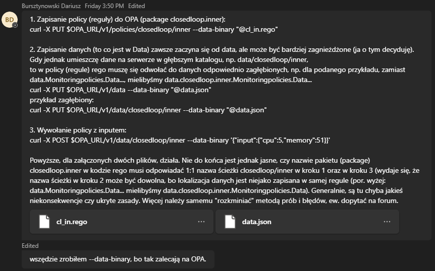

"Nie jest do końca jednak jasne...." - **ODP:** nazwa pakietu (tu `closedloop/inner`) nie musi odpowiadać nazwie ścieżki z kroku 1, za to musi odpowiadać nazwie z kroku 3. 

Uderzając w endpoint `policies` tworzymy pliki `.rego` z regułami. To jaką strukturę paczek i reguł utworzą one w data jest odseparowane od tego w jakich folderach je umieścimy. Sama treść pliku determinuje jakie tworzy on paczki i reguły (strukturę w data), a nie jego lokalizacja pod endpointem `policies`. Jako admin serwera opa można oczywiście zachować spójność pod tym kątem, ale nie jest to wymagane. 

Uderzając w endpoint `/policies/closedloop/inner` tworzymy folder `closedloop` a w nim plik `inner` o treści podanej w `--data-binary` tego żądania. Opisuje to ten obrazek: https://github.com/0x41gawor/pcrf-opa?tab=readme-ov-file#policies.

Dlatego gdy reprodukując kroki z wiadomości w kroku 1 użyjemy innego url (położymy plik z regułami w innym miejscu) to reszta pozostanie taka sama. Struktura packages i rules w data nie zmieni się.

```sh
curl -X PUT $OPA_URL/v1/policies/policy1 --data-binary "@cl_in.rego"
```

**Odnośnie punktu 2**

Zgadza się. Endpoint `/data` udostępnia nam wielki json'owy dokument za pomocą interfejsu REST HTTP. https://github.com/0x41gawor/pcrf-opa?tab=readme-ov-file#data

Z poziomu kodu `.rego` zawsze zaczynamy od korzenia data'y nieważne w jakim package jest plik `.rego`. Dlatego jeśli coś (dane w json) położymy pod url `data/closedloop/inner` to potem w kodzie musimy odwołać się do tego jako `data.closedloop/inner.

**Wywołanie policy z inputem**

Zauważmy, że endpoint do zarządzania `data` oraz do robienia query jest ten sam. Tak naprawdę POST na endpoint `data` to jest to samo co GET tylko, że w możliwością dostarczenia inputu oraz prośbą o ewaluacje rules (czyli de facto zmiennych data).

W ramach zaobserwowania tego działania warto wykonać kilka http request z inputem 

```json
{
    "input": {
        "cpu": 5,
        "memory": 51
    }
}
```

na url:

- `$OPA_URL/v1/data/`
- `$OPA_URL/v1/data/closedloop`
- `$OPA_URL/v1/data/closedloop/inner`
- `$OPA_URL/v1/data/closedloop/inner/cpu`
- `$OPA_URL/v1/data/closedloop/inner/memory`

Proszę zwrócić uwagę na to kiedy rules się ewaluują a kiedy nie.

**Worth to note**

Warto zaznajomić się z konceptem base oraz virtual documents w OPA https://www.openpolicyagent.org/docs/latest/philosophy/#the-opa-document-model.

Packages zdefiniowane w plikach `.rego` dostają w dokumencie `data` swój json field i tam są wszystkie niezewaluowane zminne, które są zadeklarowane w tej paczce. Dlatego, gdy wykonamy `GET $OPA_URL/v1/data` to otrzymany json w swoim root oprócz pól które mu wcześniej wrzuciliśmy (`DecisionPolicies` oraz `MonitoringPolicies`) ma jeszcze pole `closedloop`.

# Reminder

Dokument stanowi moją dotychczasową teorię na temat OPA, która możliwe że ulegnie lekkim zmianom. Dużo też jest tutaj domysłów (które narazie są empirycznie potwierdzalne), bazujących na doświadczeniach z innych systemów informatycznych. Możliwe, że obecna teoria zostanie wyparta przez nową, ale dla rozpatrzonych przypadków - działa. Tak samo jak teoria Einsteina "nadpisała" teorię Newtona.